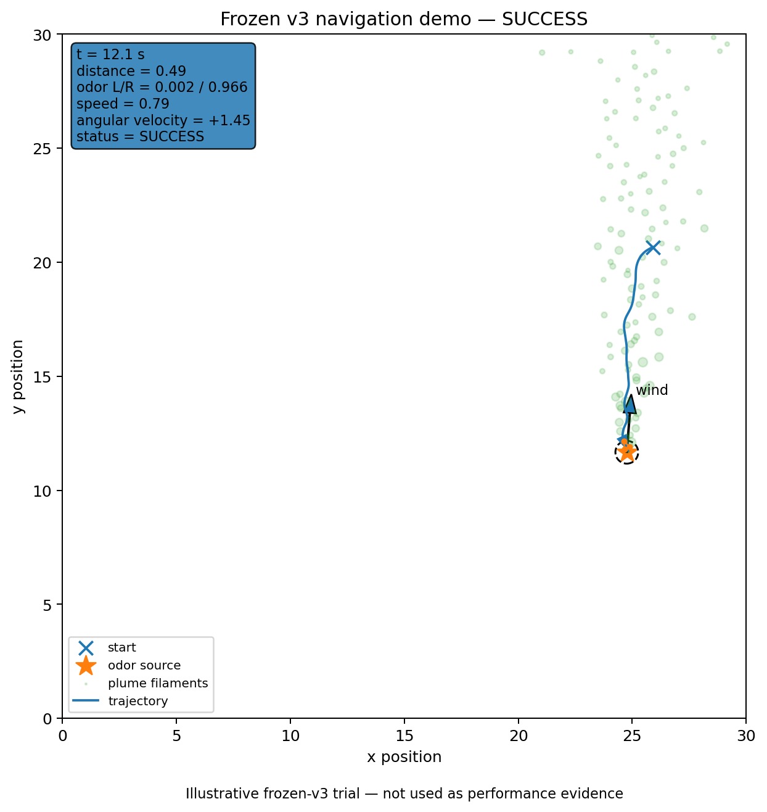
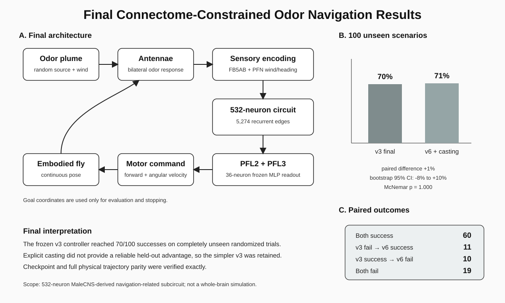
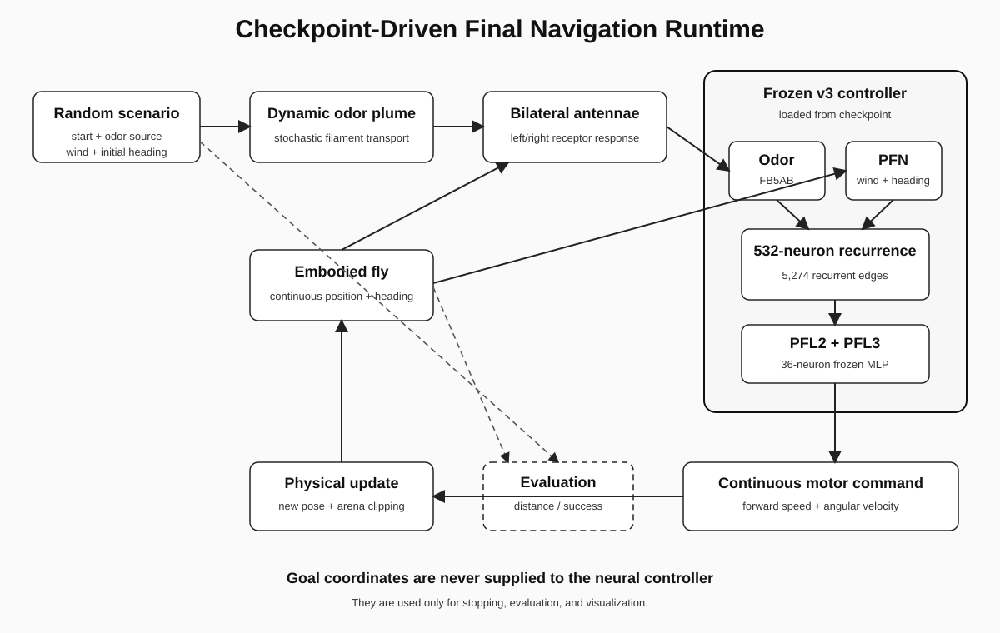

# Drosophila Connectome-Constrained Odor Navigation

[](https://www.python.org/)
[](#)
[](#)
[](#)
[](https://www.kaggle.com/datasets/binivin/drosophila-connectome-odor-navigation)
[](https://www.kaggle.com/code/binivin/connectome-odor-navigation-in-drosophila)

> Closed-loop odor-source navigation in a virtual *Drosophila* using a 532-neuron MaleCNS-derived recurrent subcircuit, modeled sensory inputs, and a learned PFL motor readout.

This repository contains a connectome-constrained embodied navigation project based on a navigation-related subset of the public MaleCNS connectome. The final frozen v3 controller achieved **70/100 successes on 100 completely unseen randomized scenarios**.

The system should be interpreted as a **connectome-constrained controller**, not as a whole-brain or fully biophysical fruit-fly simulation.

---

## Highlights

- **532-neuron** MaleCNS-derived navigation-related recurrent subcircuit
- **5,274 recurrent edges** after synapse-threshold filtering
- bilateral odor encoding through a virtual FB5AB mapping
- continuous PFN wind + externally supplied body-heading encoding
- **36 PFL2/PFL3 neurons** used as the learned motor-readout population
- continuous 2-D embodied fly with bilateral antennae and a stochastic intermittent plume
- final v3 performance: **70/100** on 100 untouched random scenarios
- exact checkpoint/runtime parity and exact full physical-trajectory parity
- matched held-out comparison against an explicit behavioral casting extension
- failed temporal/search extensions retained as negative scientific results

---

## Simulation demo

A qualitative demo is generated directly from the **same frozen v3 checkpoint-driven runtime** used in the public release.

[](artifacts/media/final_v3_navigation_demo.mp4)

- [Watch or download the MP4](artifacts/media/final_v3_navigation_demo.mp4)
- [Open the final-frame poster](artifacts/media/final_v3_navigation_demo_poster.png)

The demo visualizes the intermittent plume, odor source, wind direction, fly trajectory, heading, bilateral antenna positions, odor responses, distance to source, and continuous motor commands.

> **Important:** the video is an illustrative frozen-v3 trial and is **not used as performance evidence**. Quantitative claims come from the frozen 100-scenario held-out benchmark below.

Generate the demo from the repository root with:

```bash
python src/render_demo.py --seed 880000000
```

The default seed is a known successful trial from the already-completed frozen held-out benchmark. Choosing it for visualization does not change or re-evaluate the benchmark.

The companion Kaggle notebook also includes a **fresh post-freeze random trial** section. Those newly sampled trials are qualitative exploration only and do not update, replace, or tune the frozen 100-scenario benchmark.

---

## Graphical summary



The final v3 controller achieved 70% success on the held-out benchmark. The explicit casting extension reached 71%, but its matched improvement was not reliable: it rescued 11 trials while regressing 10, with exact McNemar p = 1.000.

---

## Kaggle companion release

The public Kaggle release provides a compact entry point for viewing the frozen artifacts and reproducing the qualitative runtime behavior.

- **Dataset:** [Drosophila Connectome Odor Navigation](https://www.kaggle.com/datasets/binivin/drosophila-connectome-odor-navigation)
- **Notebook:** [Connectome Odor Navigation in Drosophila](https://www.kaggle.com/code/binivin/connectome-odor-navigation-in-drosophila)

The Dataset contains the frozen result tables, checkpoint, runtime manifest, figures, and demo media. The Notebook summarizes the frozen benchmark and includes a fresh random-trial section using the frozen v3 checkpoint. Fresh trials remain separate from the reported held-out statistics.

---

## Research question

Can a navigation-related recurrent circuit derived from the *Drosophila* MaleCNS connectome support closed-loop odor-source localization when embedded in a continuous virtual environment with bilateral odor sensing and wind information?

---

## Project workflow

```text
Public MaleCNS connectome + neuron annotations
  -> navigation-related neuron-family selection
  -> synapse-thresholded signed recurrent matrix
  -> recurrent-state stabilization / scaling
  -> bilateral FB5AB odor encoding
  -> continuous PFN wind + body-heading encoding
  -> PFL2/PFL3 motor-readout training
  -> continuous embodied fly + intermittent plume
  -> controlled crosswind tests
  -> circuit perturbation / rewiring controls
  -> development-set controller comparisons
  -> frozen v3 selection
  -> 100-scenario untouched held-out evaluation
  -> checkpoint parity + full trajectory parity
  -> final checkpoint-driven runtime
```

---

## Final runtime architecture



The odor-source coordinates are used only for stopping, evaluation, and visualization. They are **not supplied to the neural controller**.

---

## Connectome-derived circuit

The final recurrent model contains navigation-related families including:

```text
FB5AB
PFNa
PFNp
PFNm
hDeltaC
FC2B
FC2C
FB5N
PFL2
PFL3
```

| Quantity | Value |
|---|---:|
| Neurons | 532 |
| Recurrent edges | 5,274 |
| PFL motor-readout neurons | 36 |
| Recurrent leak | 0.5 |
| Recurrent spectral-radius target | 0.9 |
| Forward-speed bounds | 0.0 to 0.85 |
| Angular-velocity bounds | -2.5 to 2.5 |

The connectome is used as a structural constraint on recurrent interactions. Neurotransmitter signs, sensory mappings, recurrent scaling, and several PFN conventions remain modeling assumptions rather than full biological reconstructions.

---

## Embodied virtual environment

The final environment contains continuous 2-D position, continuous heading, bilateral antennae, a stochastic intermittent filament plume, continuous forward/angular motor commands, finite arena boundaries, and randomized start/source/wind/heading conditions.

For the final benchmark, start-to-source distance was constrained to approximately **9–14 arena units**, with starts generated roughly downwind of the odor source. The benchmark therefore evaluates **odor-source localization from randomized downwind starting conditions**, not arbitrary waypoint navigation.

The plume is a phenomenological filament model rather than a Navier–Stokes CFD simulation.

---

## Main results

### 1. Final v3 controller generalized to unseen random scenarios

The frozen v3 controller was evaluated once on **100 completely unused random scenarios**.

| Metric | Final v3 |
|---|---:|
| Successes | 70 / 100 |
| Success rate | 70% |
| Wilson 95% CI | 60.4%–78.1% |
| Mean minimum source distance | 1.136 |
| Median minimum source distance | 0.489 |
| Mean whiff fraction | 0.648 |
| Total boundary contacts | 8 |

The frozen result table is available at `artifacts/tables/final_heldout_summary.csv`.

### 2. Explicit casting did not provide a reliable held-out improvement

A hybrid v6 controller added an explicit phenomenological casting behavior after odor loss. This behavioral module was outside the 532-neuron connectome-constrained circuit.

| Controller | Successes | Success rate |
|---|---:|---:|
| v3 connectome-constrained tracking | 70 / 100 | 70% |
| v6 tracking + explicit casting | 71 / 100 | 71% |

Paired outcomes were 60 both-success, 11 v3-fail/v6-success, 10 v3-success/v6-fail, and 19 both-fail. The paired success-rate difference was **+1 percentage point**, with paired bootstrap 95% CI **-8% to +10%** and exact McNemar **p = 1.000**.

Because the hybrid extension did not demonstrate a reliable generalization advantage and introduced an external behavioral module, **v3 was retained as the final controller**.

### 3. Crosswind controls supported dependence on odor information

| Condition | Successes |
|---|---:|
| Intact controller | 9 / 20 |
| Bilateral contrast removed | 0 / 20 |
| Odor removed | 0 / 20 |

This supports the importance of odor information and bilateral contrast in the implemented navigation policy. However, the motor-training teacher itself contains a bilateral-contrast term, so this should **not** be interpreted as an independent biological discovery about living fly circuitry.

### 4. Connectome perturbation and rewiring analyses

Fixed-state replay analyses showed that perturbing specific connectome populations, particularly PFN-related populations, altered downstream readout features more strongly than size-matched random controls. Degree-preserving rewiring controls also produced poorer decodability than the original topology.

These are model-level results and do not establish identical causal relationships in vivo.

### 5. Negative results

| Controller | Development successes | Interpretation |
|---|---:|---|
| v3 | 20 / 30 | final pure connectome-constrained tracker |
| v4 temporal memory | 7 / 30 | hidden-memory teacher did not transfer well to closed loop |
| v5.1 memory-free search | 1 / 30 | strong offline fit but poor embodied plume reacquisition |
| v6 explicit casting | 22 / 30 | hybrid behavioral extension; tested again on held-out set |
| v6.1 selective casting | 20 / 30 | selective gate did not improve development performance |

These failures illustrate an important embodied-modeling lesson: **high offline decoder accuracy does not guarantee successful closed-loop navigation**.

---

## Reproducibility

Final checkpoint:

```text
artifacts/checkpoints/final_v3_connectome_controller.joblib
```

Expected SHA256:

```text
8d6b557bb592f29100fdf8d95cb3ccd91f608516f6862e3f772491461e983acc
```

Exact validation established:

- recurrent matrix parity: exact
- raw MLP/scaler parity: exact
- motor-runtime clipping parity: exact
- 500-step recurrent controller parity: exact
- full physical trajectory parity: exact for seed `851042066`
- plume snapshot parity: exact

The official runtime is checkpoint-driven rather than dependent on the original training objects.

---

## Repository structure

```text
drosophila-connectome-odor-navigation/
├─ README.md
├─ requirements.txt
├─ .gitignore
├─ src/
│  ├─ final_runtime.py
│  ├─ render_demo.py
│  ├─ verify_checkpoint.py
│  ├─ plot_final_results.py
│  └─ README.md
├─ notebooks/
│  ├─ connectome_odor_navigation_final.ipynb
│  └─ README.md
├─ artifacts/
│  ├─ figures/
│  │  ├─ final_results_summary.svg
│  │  ├─ final_runtime_architecture.svg
│  │  └─ README.md
│  ├─ media/
│  │  ├─ final_v3_navigation_demo.mp4
│  │  ├─ final_v3_navigation_demo_poster.png
│  │  └─ README.md
│  ├─ tables/
│  │  ├─ final_heldout_summary.csv
│  │  ├─ final_paired_outcomes.csv
│  │  ├─ paired_statistics.csv
│  │  ├─ crosswind_control_summary.csv
│  │  ├─ development_controller_summary.csv
│  │  └─ README.md
│  ├─ checkpoints/
│  │  ├─ final_v3_connectome_controller.joblib
│  │  └─ README.md
│  └─ manifests/
│     └─ final_runtime_manifest.json
├─ docs/
│  ├─ final_research_summary.md
│  ├─ project_summary_ko.md
│  └─ modeling_conventions.md
└─ data/
   └─ README.md
```

Raw MaleCNS connectome files are not redistributed through this repository. `data/README.md` documents the expected external inputs.

---

## How to reproduce

### 1. Install dependencies

```bash
pip install -r requirements.txt
```

### 2. Verify the frozen checkpoint

```bash
python src/verify_checkpoint.py
```

### 3. Run a deterministic final trial

```bash
python src/final_runtime.py --seed 851042066
```

A different integer seed generates a new randomized start/source/wind scenario under the same frozen runtime.

### 4. Render an illustrative simulation video

```bash
python src/render_demo.py --seed 880000000
```

This writes the MP4 and poster image under `artifacts/media/`. The demo is qualitative and does not replace the held-out benchmark.

### 5. Recreate the held-out summary plot

```bash
python src/plot_final_results.py
```

### 6. Open the final summary notebook

```text
notebooks/connectome_odor_navigation_final.ipynb
```

Or use the live Kaggle companion notebook:

https://www.kaggle.com/code/binivin/connectome-odor-navigation-in-drosophila

---

## Documentation

| Document | Description |
|---|---|
| `docs/final_research_summary.md` | Canonical English research summary |
| `docs/project_summary_ko.md` | Korean project summary |
| `docs/modeling_conventions.md` | Biological/modeling assumptions and claim boundaries |
| `artifacts/manifests/final_runtime_manifest.json` | Frozen runtime metadata and exact checkpoint hash |
| `artifacts/tables/` | Final held-out, control, and development result tables |
| `artifacts/media/README.md` | Simulation-demo provenance and interpretation |

---

## Interpretation

> A 532-neuron MaleCNS-derived navigation-related subcircuit, combined with modeled sensory encoding and a learned PFL motor readout, can support closed-loop odor-source localization in a stochastic virtual plume environment, reaching 70% success on 100 previously unseen randomized scenarios.

---

## Limitations

- This is a **532-neuron navigation-related subcircuit**, not the complete fly CNS or brain.
- Acetylcholine was modeled as excitatory and glutamate as inhibitory as a simplified sign convention.
- Connectome edges below the selected synapse threshold were removed.
- The recurrent matrix was spectrally rescaled for dynamical stability.
- PFN phase information and wind-side preferences are partly inferred or model-defined.
- Bilateral odor is virtually mapped onto the FB5AB pair; this is not claimed as established antenna-to-FB5AB anatomy.
- Body heading is supplied externally rather than generated by a reconstructed E-PG compass circuit.
- The PFL motor readout is learned from a designed local plume-tracking teacher.
- The plume is a stochastic filament model rather than full computational fluid dynamics.
- The random benchmark tests odor-source localization from approximately downwind initial conditions rather than arbitrary-target navigation.
- Perturbation and rewiring effects are model-level results and do not prove identical biological causality in vivo.

---

## Project status

The controller, held-out benchmark, checkpoint, and runtime parity tests are frozen. Further tuning on the existing development or held-out sets is intentionally stopped.

The GitHub core release and companion Kaggle Dataset/Notebook are now linked as the public release surfaces. Fresh random trials in the Kaggle notebook are post-freeze qualitative demonstrations only and do not alter the frozen benchmark.